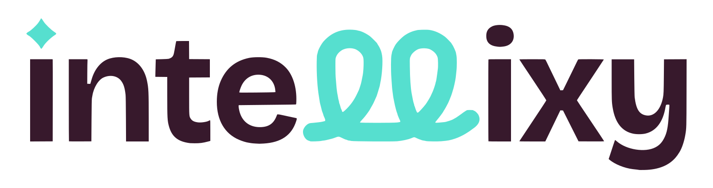

<p align="center">
  
</p>

# Intellixy

Convierte el material que el estudiante ya tiene (PDF, fotos de apuntes, texto) en herramientas para estudiarlo: quizzes, flashcards y un tutor IA con citas a la fuente.

Ver `Intellixy · Plan del proyecto v2.md` para la visión completa, arquitectura, modelo de datos y roadmap.

## Estructura

```
apps/
  web/   Next.js + TypeScript (frontend)
  api/   Node + Express + TypeScript (API REST)
```

Ambos clientes (web y, más adelante, Android) hablan únicamente con la API; ningún cliente accede directo a la base de datos o al servicio de IA.

## Desarrollo

```bash
npm install

npm run dev:web   # http://localhost:3000
npm run dev:api   # http://localhost:4000
```

Copiar `apps/api/.env.example` a `apps/api/.env` y completar las variables.
